# Agentic Context Engine (ACE) 


[](https://discord.gg/mqCqH7sTyK)
[](https://twitter.com/kaybaai)
[](https://badge.fury.io/py/ace-framework)
[](https://www.python.org/downloads/)


**AI agents that get smarter with every task 🧠**

Agentic Context Engine learns from your agent's successes and failures. Just plug in and watch your agents improve.

Star ⭐️ this repo if you find it useful!

---

## 🤖 LLM Quickstart
1. Direct your favorite coding agent (Cursor, Claude Code, Codex, etc) to [Quick Start Guide](https://github.com/kayba-ai/agentic-context-engine/blob/main/docs/QUICK_START.md)
2. Prompt away!

---

## ✋ Quick Start

### 1. Install

```bash
pip install ace-framework
```

### 2. Set Your API Key

```bash
export OPENAI_API_KEY="your-api-key"
# Or use Claude, Gemini, or 100+ other providers
```

### 3. Create Your First ACE Agent

```python
from ace import ACELiteLLM

# Create agent that learns automatically
agent = ACELiteLLM(model="gpt-4o-mini")

# Ask questions - it learns from each interaction
answer1 = agent.ask("What is 2+2?")
print(f"Answer: {answer1}")

answer2 = agent.ask("What is the capital of France?")
print(f"Answer: {answer2}")

# Agent now has learned strategies!
print(f"✅ Learned {len(agent.playbook.bullets())} strategies")

# Save for later
agent.save_playbook("my_agent.json")
```

🎉 **Your agent just got smarter!** It learned from examples and improved.

---

## 🎯 Out-of-Box Integrations

ACE provides three ready-to-use integrations for different use cases:

### **ACELiteLLM** - Simplest Start 🚀

Perfect for quick prototyping and simple tasks:

```python
from ace import ACELiteLLM

agent = ACELiteLLM(model="gpt-4o-mini")
answer = agent.ask("What is 2+2?")  # Uses learned strategies
```

**Best for:** Q&A, classification, reasoning tasks

### **ACEAgent (browser-use)** - Browser Automation 🌐

Self-improving browser agents with [browser-use](https://github.com/browser-use/browser-use):

```python
from ace import ACEAgent
from browser_use import ChatBrowserUse

agent = ACEAgent(llm=ChatBrowserUse())
await agent.run(task="Find top Hacker News post")  # Learns from each run
```

**Best for:** Web scraping, form filling, browser testing

### **ACELangChain** - Complex Workflows ⛓️

Wrap any LangChain chain/agent with learning:

```python
from ace import ACELangChain

ace_chain = ACELangChain(runnable=your_langchain_chain)
result = ace_chain.invoke({"input": "Your task"})  # Learns automatically
```

**Best for:** Multi-step workflows, tool-using agents, LangChain orchestration

**[→ Full Integration Guide](docs/INTEGRATION_GUIDE.md)**

---

## 🌐 Browser Automation with ACE

ACE integrates seamlessly with [browser-use](https://github.com/browser-use/browser-use) for self-improving browser agents:

```bash
pip install ace-framework[browser-use]
```

```python
from ace.integrations import ACEAgent  # or: from ace import ACEAgent
from browser_use import ChatBrowserUse
import asyncio

async def main():
    # Drop-in replacement for browser-use Agent
    # Two LLMs: ChatBrowserUse for browser execution, gpt-4o-mini for ACE learning
    agent = ACEAgent(
        llm=ChatBrowserUse(),      # Browser execution
        ace_model="gpt-4o-mini"    # ACE learning (Reflector/Curator)
    )

    # Runs and learns automatically
    await agent.run(task="Find top Hacker News post")
    await agent.run(task="Find second HN post")  # Smarter!

    # Save learned knowledge
    agent.save_playbook("hn_expert.json")

asyncio.run(main())
```

**Reuse learned knowledge:**
```python
# Load existing playbook to start with pre-trained strategies
agent = ACEAgent(llm=ChatBrowserUse(), playbook_path="hn_expert.json")
await agent.run(task="New task")  # Starts smart!
```

**Key Features:**
- ✅ Drop-in replacement for `browser_use.Agent`
- ✅ Automatic learning from browser executions
- ✅ Reusable playbooks across sessions
- ✅ Toggle learning on/off with `is_learning` flag
- ✅ Works with all browser-use LLMs (ChatOpenAI, ChatBrowserUse, etc.)

**Build your own integration:** See [Integration Guide](docs/INTEGRATION_GUIDE.md) to add ACE learning to any custom agentic system.

**Examples:**
- [simple_ace_agent.py](examples/browser-use/simple_ace_agent.py) - Complete browser-use example
- [custom_integration_example.py](examples/custom_integration_example.py) - Minimal custom agent integration

---

## Why Agentic Context Engine (ACE)?

AI agents make the same mistakes repeatedly.

ACE enables agents to learn from execution feedback: what works, what doesn't, and continuously improve. <br> No training data, no fine-tuning, just automatic improvement.

### Clear Benefits
- 📈 **20-35% Better Performance**: Proven improvements on complex tasks
- 🧠 **Self-Improving**: Agents get smarter with each task
- 🔄 **No Context Collapse**: Preserves valuable knowledge over time
- 🚀 **100+ LLM Providers**: Works with OpenAI, Anthropic, Google, and more
- 📊 **Production Observability**: Built-in Opik integration for enterprise monitoring

---

## Demos

### 🌊 The Seahorse Emoji Challenge

A challenge where LLMs often hallucinate that a seahorse emoji exists (it doesn't).


In this example:
- **Round 1**: The agent incorrectly outputs 🐴 (horse emoji)
- **Self-Reflection**: ACE reflects without any external feedback
- **Round 2**: With learned strategies from ACE, the agent successfully realizes there is no seahorse emoji

Try it yourself:
```bash
uv run python examples/kayba_ace_test.py
```

### 🌐 Browser Use Automation Demos

#### 🛒 Online Shopping Demo

A grocery shopping automation comparison where both agents find the basket price for 5 essential items at Migros online store. 
- **ACE Agent**: Learns efficient product search patterns and UI navigation strategies improving performance over time
- **Baseline Agent**: Struggles with inconsistent website interactions and search failures


**ACE Performance**:
- **29.8% fewer steps** on average (57.2 vs 81.5)
- **49.0% reduction** in browser-use tokens (595k vs 1,166k)
- **42.6% total cost reduction** even when including ACE learning overhead

Try it yourself:
```bash
# Run baseline version (no learning)
uv run python examples/browser-use/online-shopping/baseline-online-shopping.py

# Run ACE-enhanced version (learns and improves)
uv run python examples/browser-use/online-shopping/ace-online-shopping.py
```

**[→ More Examples & Full Browser Use Documentation](examples/browser-use/README.md)**

---

## How does Agentic Context Engine (ACE) work?

*Based on the [ACE research framework](https://arxiv.org/abs/2510.04618) from Stanford & SambaNova.*

ACE uses three specialized roles that work together:
1. **🎯 Generator** - Creates strategies using learned patterns from the playbook
2. **🔍 Reflector** - Analyzes what worked and what didn't after execution
3. **📝 Curator** - Updates the playbook with new strategies based on reflection

**Important:** The three ACE roles are different specialized prompts using the same language model, not separate models.

ACE teaches your agent and internalises:
- **✅ Successes** → Extract patterns that work
- **❌ Failures** → Learn what to avoid
- **🔧 Tool usage** → Discover which tools work best for which tasks
- **🎯 Edge cases** → Remember rare scenarios and how to handle them

The magic happens in the **Playbook**—a living document of strategies that evolves with experience. <br>
**Key innovation:** All learning happens **in context** through incremental updates—no fine-tuning, no training data, and complete transparency into what your agent learned.

```mermaid
---
config:
  look: neo
  theme: neutral
---
flowchart LR
    Playbook[("`**📚 Playbook**<br>(Evolving Context)<br><br>•Strategy Bullets<br> ✓ Helpful strategies <br>✗ Harmful patterns <br>○ Neutral observations`")]
    Start(["**📝Query** <br>User prompt or question"]) --> Generator["**⚙️Generator** <br>Executes task using playbook"]
    Generator --> Reflector
    Playbook -. Provides Context .-> Generator
    Environment["**🌍 Task Environment**<br>Evaluates answer<br>Provides feedback"] -- Feedback+ <br>Optional Ground Truth --> Reflector
    Reflector["**🔍 Reflector**<br>Analyzes and provides feedback what was helpful/harmful"]
    Reflector --> Curator["**📝 Curator**<br>Produces improvement deltas"]
    Curator --> DeltaOps["**🔀Merger** <br>Updates the playbook with deltas"]
    DeltaOps -- Incremental<br>Updates --> Playbook
    Generator <--> Environment
```



---

## Installation Options

```bash
# Basic installation (~100MB - includes LiteLLM for 100+ providers)
pip install ace-framework

# With production monitoring (Opik integration)
pip install ace-framework[observability]

# With LangChain integration (enterprise)
pip install ace-framework[langchain]

# With local model support (Transformers)
pip install ace-framework[transformers]

# With all optional features (~500MB)
pip install ace-framework[all]

# Mix and match
pip install ace-framework[observability,langchain]

# Development from source (contributors) - UV Method (10-100x faster)
git clone https://github.com/kayba-ai/agentic-context-engine
cd agentic-context-engine
uv sync                    # Installs core + dev tools

# To run browser automation demos (contributors only)
uv sync --group demos      # Also installs browser-use, playwright, etc.
```

## Configuration

ACE works with any LLM provider through LiteLLM:

```python
# OpenAI
client = LiteLLMClient(model="gpt-4o")

# With fallbacks for reliability
client = LiteLLMClient(
    model="gpt-4",
    fallbacks=["claude-3-haiku", "gpt-3.5-turbo"]
)
```

### Observability with Opik

ACE includes built-in Opik integration for production monitoring and debugging.
If Opik is not installed or configured, ACE continues to work normally without tracing. No code changes needed.

#### Quick Start
```bash
# Install with Opik support
pip install ace-framework opik

# Set your Opik API key (or use local deployment)
export OPIK_API_KEY="your-api-key"
export OPIK_PROJECT_NAME="ace-project"
```

#### What Gets Tracked
When Opik is available, ACE automatically logs:
- **Generator**: Input questions, reasoning, and final answers
- **Reflector**: Error analysis and bullet classifications
- **Curator**: Playbook updates and delta operations
- **Playbook Evolution**: Changes to strategies over time

#### Viewing Traces
```python
# Opik tracing is automatic - just run your ACE code normally
from ace import Generator, Reflector, Curator, Playbook
from ace.llm_providers import LiteLLMClient

# All role interactions are automatically tracked
generator = Generator(llm_client)
output = generator.generate(
    question="What is 2+2?",
    context="Show your work",
    playbook=playbook
)
# View traces at https://www.comet.com/opik or your local Opik instance
```

---

## Documentation

- [Quick Start Guide](docs/QUICK_START.md) - Get running in 5 minutes
- [API Reference](docs/API_REFERENCE.md) - Complete API documentation
- [Examples](examples/) - Ready-to-run code examples
  - [Browser Automation](examples/browser-use/) - Self-improving browser agents
  - [LangChain Integration](examples/langchain/) - Wrap chains/agents with learning
  - [Custom Integration](examples/custom_integration_example.py) - Pattern for any agent
- [Integration Guide](docs/INTEGRATION_GUIDE.md) - Add ACE to existing agents
- [ACE Framework Guide](docs/COMPLETE_GUIDE_TO_ACE.md) - Deep dive into Agentic Context Engineering
- [Prompt Engineering](docs/PROMPT_ENGINEERING.md) - Advanced prompt techniques
- [Benchmarks](benchmarks/README.md) - Evaluate ACE performance with scientific rigor across multiple datasets
- [Changelog](CHANGELOG.md) - See recent changes

---

## Contributing

We love contributions! Check out our [Contributing Guide](CONTRIBUTING.md) to get started.

---

## Acknowledgment

Based on the [ACE paper](https://arxiv.org/abs/2510.04618) and inspired by [Dynamic Cheatsheet](https://arxiv.org/abs/2504.07952).

If you use ACE in your research, please cite:
```bibtex
@article{zhang2024ace,title={Agentic Context Engineering},author={Zhang et al.},journal={arXiv:2510.04618},year={2024}}
```


<div align="center">

<br>

**⭐ Star this repo if you find it useful!** <br>
**Built with ❤️ by [Kayba](https://kayba.ai) and the open-source community.**

</div>
