# Agentic Context Engine (ACE) 


[](https://discord.gg/mqCqH7sTyK)
[](https://twitter.com/kaybaai)
[](https://badge.fury.io/py/ace-framework)
[](https://www.python.org/downloads/)


**AI agents that get smarter with every task 🧠**

Agentic Context Engine learns from your agent's successes and failures. Just plug in and watch your agents improve.

Star ⭐️ this repo if you find it useful!

---

## 🤖 LLM Quickstart
1. Direct your favorite coding agent (Cursor, Claude Code, Codex, etc) to [Quick Start Guide](docs/QUICK_START.md)
2. Prompt away!

---

## ✋ Quick Start

### 1. Install

```bash
pip install ace-framework
```

### 2. Set API Key

```bash
export OPENAI_API_KEY="your-api-key"
```

### 3. Run

```python
from ace import ACELiteLLM

agent = ACELiteLLM(model="gpt-4o-mini")

answer = agent.ask("What does Kayba's ACE framework do?")
print(answer)  # "ACE allows AI agents to remember and learn from experience!"
```

🎉 **Done! Your agent learns automatically from each interaction.**

---

## 🎯 Integrations

ACE provides four ready-to-use integrations:

**[→ Integration Guide](docs/INTEGRATION_GUIDE.md)** | **[→ Examples](examples/)**

### 1. **ACELiteLLM** - Simplest Start 🚀

Create your self-improving agent:

<details>
<summary>Click to view code example</summary>

```python
from ace import ACELiteLLM

# Create self-improving agent
agent = ACELiteLLM(model="gpt-4o-mini")

# Ask related questions - agent learns patterns
answer1 = agent.ask("If all cats are animals, is Felix (a cat) an animal?")
answer2 = agent.ask("If all birds fly, can penguins (birds) fly?")  # Learns to check assumptions!
answer3 = agent.ask("If all metals conduct electricity, does copper conduct electricity?")

# View learned strategies
print(f"✅ Learned {len(agent.skillbook.skills())} reasoning skills")

# Save for reuse
agent.save_skillbook("my_agent.json")

# Load and continue
agent2 = ACELiteLLM(model="gpt-4o-mini", skillbook_path="my_agent.json")
```

</details>
<br>

### 2. **ACELangChain** - Wrap ACE Around Your Existing Agent ⛓️

Wrap any LangChain chain/agent with learning:

**Best for:** Multi-step workflows, tool-using agents

<details>
<summary>Click to view code example</summary>

```python
from ace import ACELangChain

ace_chain = ACELangChain(runnable=your_langchain_chain)
result = ace_chain.invoke({"question": "Your task"})  # Learns automatically
```

</details>
<br>

### 3. **ACEAgent** - Enhance Browser-Use Agent with Self-Optimizing 🌐

Self-improving browser agents with [browser-use](https://github.com/browser-use/browser-use):

**Features:** Drop-in replacement for `browser_use.Agent`, automatic learning, reusable skillbooks
**[→ Browser Use Guide](examples/browser-use/README.md)**

<details>
<summary>Click to view code example</summary>

```bash
pip install ace-framework[browser-use]
```

```python
from ace import ACEAgent
from browser_use import ChatBrowserUse

# Two LLMs: ChatBrowserUse for browser, gpt-4o-mini for ACE learning
agent = ACEAgent(
    llm=ChatBrowserUse(),      # Browser execution
    ace_model="gpt-4o-mini"    # ACE learning
)

await agent.run(task="Find top Hacker News post")
agent.save_skillbook("hn_expert.json")

# Reuse learned knowledge
agent = ACEAgent(llm=ChatBrowserUse(), skillbook_path="hn_expert.json")
await agent.run(task="New task")  # Starts smart!
```

</details>
<br>

### 4. **ACEClaudeCode** - Claude Code CLI 💻

Self-improving coding agent using [Claude Code](https://claude.ai/code):

**Features:** Claude Code CLI wrapper, automatic learning, task execution traces
**[→ Claude Code Loop Example](examples/claude-code-loop/)**

<details>
<summary>Click to view code example</summary>

```python
from ace import ACEClaudeCode

agent = ACEClaudeCode(
    working_dir="./my_project",
    ace_model="gpt-4o-mini"
)

# Execute coding tasks - agent learns from each
result = agent.run(task="Add unit tests for utils.py")
agent.save_skillbook("coding_expert.json")

# Reuse learned knowledge
agent = ACEClaudeCode(working_dir="./project", skillbook_path="coding_expert.json")
```

</details>

---

## Why Agentic Context Engine (ACE)?

AI agents make the same mistakes repeatedly.

ACE enables agents to learn from execution feedback: what works, what doesn't, and continuously improve. <br> No training data, no fine-tuning, just automatic improvement.

### Clear Benefits
- 🧠 **Self-Improving**: Agents autonomously get smarter with each task
- 📈 **20-35% Better Performance**: Proven improvements on complex tasks
- 📉 **Reduce Token Usage**: Demonstrated 49% reduction in browser-use example

### Features
- 🔄 **No Context Collapse**: Preserves valuable knowledge over time
- ⚡ **Async Learning**: Agent responds instantly while learning happens in background
- 🚀 **100+ LLM Providers**: Works with OpenAI, Anthropic, Google, and more
- 📊 **Production Observability**: Built-in Opik integration for enterprise monitoring
- 🔄 **Smart Deduplication**: Automatically consolidates similar skills

---

## Demos

### 🌊 The Seahorse Emoji Challenge

A challenge where LLMs often hallucinate that a seahorse emoji exists (it doesn't).


In this example:
- **Round 1**: The agent incorrectly outputs 🐴 (horse emoji)
- **Self-Reflection**: ACE reflects without any external feedback
- **Round 2**: With learned skills from ACE, the agent successfully realizes there is no seahorse emoji

Try it yourself:
```bash
uv run python examples/litellm/seahorse_emoji_ace.py
```

### 🌐 Browser Automation

**Online Shopping Demo**: ACE vs baseline agent shopping for 5 grocery items.


**ACE Performance:**
- **29.8% fewer steps** (57.2 vs 81.5)
- **49.0% token reduction** (595k vs 1,166k)
- **42.6% cost reduction** (including ACE overhead)

**[→ Try it yourself & see all demos](examples/browser-use/README.md)**

### 💻 Claude Code Loop

Continuous autonomous coding: Claude Code runs a task, ACE learns from execution, skills get injected into the next iteration.

**Python → TypeScript Translation:**

| Metric           | Result                               |
| ---------------- | ------------------------------------ |
| ⏱️ Duration      | ~4 hours                             |
| 📝 Commits       | 119                                  |
| 📏 Lines written | ~14k                                 |
| ✅ Outcome       | Zero build errors, all tests passing |
| 💰 API cost      | ~$1.5 (Sonnet for learning)          |

**[→ Try it yourself](examples/claude-code-loop/)**

---

## How does Agentic Context Engine (ACE) work?

*Based on the [ACE research framework](https://arxiv.org/abs/2510.04618) from Stanford & SambaNova.*

ACE uses three specialized roles that work together:
1. **🎯 Agent** - Creates a plan using learned skills and executes the task
2. **🔍 Reflector** - Analyzes what worked and what didn't after execution
3. **📝 SkillManager** - Updates the skillbook with new skills based on reflection

**Important:** The three ACE roles are different specialized prompts using the same language model, not separate models.

ACE teaches your agent and internalises:
- **✅ Successes** → Extract patterns that work
- **❌ Failures** → Learn what to avoid
- **🔧 Tool usage** → Discover which tools work best for which tasks
- **🎯 Edge cases** → Remember rare scenarios and how to handle them

The magic happens in the **Skillbook**—a living document of skills that evolves with experience. <br>
**Key innovation:** All learning happens **in context** through incremental updates—no fine-tuning, no training data, and complete transparency into what your agent learned.

```mermaid
---
config:
  look: neo
  theme: neutral
---
flowchart LR
    Skillbook[("`**📚 Skillbook**<br>(Evolving Context)<br><br>•Strategy Skills<br> ✓ Helpful skills <br>✗ Harmful patterns <br>○ Neutral observations`")]
    Start(["**📝Query** <br>User prompt or question"]) --> Agent["**⚙️Agent** <br>Executes task using skillbook"]
    Agent --> Reflector
    Skillbook -. Provides Context .-> Agent
    Environment["**🌍 Task Environment**<br>Evaluates answer<br>Provides feedback"] -- Feedback+ <br>Optional Ground Truth --> Reflector
    Reflector["**🔍 Reflector**<br>Analyzes and provides feedback what was helpful/harmful"]
    Reflector --> SkillManager["**📝 SkillManager**<br>Produces improvement updates"]
    SkillManager --> UpdateOps["**🔀Merger** <br>Updates the skillbook with updates"]
    UpdateOps -- Incremental<br>Updates --> Skillbook
    Agent <--> Environment
```



---

## Installation

```bash
# Basic
pip install ace-framework

# With extras
pip install ace-framework[browser-use]      # Browser automation
pip install ace-framework[langchain]        # LangChain
pip install ace-framework[observability]    # Opik monitoring
pip install ace-framework[all]              # All features
```

## Configuration

ACE works with any LLM provider through LiteLLM:

```python
# OpenAI
client = LiteLLMClient(model="gpt-4o")

# With fallbacks for reliability
client = LiteLLMClient(
    model="gpt-4",
    fallbacks=["claude-3-haiku", "gpt-3.5-turbo"]
)
```

### Production Monitoring

ACE includes built-in Opik integration for tracing and cost tracking:

```bash
pip install ace-framework[observability]
export OPIK_API_KEY="your-api-key"
```

Automatically tracks: LLM calls, costs, skillbook evolution. View at [comet.com/opik](https://www.comet.com/opik)

---

## Documentation

- [Quick Start Guide](docs/QUICK_START.md) - Get running in 5 minutes
- [API Reference](docs/API_REFERENCE.md) - Complete API documentation
- [Examples](examples/) - Ready-to-run code examples
  - [Browser Automation](examples/browser-use/) - Self-improving browser agents
  - [LangChain Integration](examples/langchain/) - Wrap chains/agents with learning
  - [Custom Integration](examples/custom_integration_example.py) - Pattern for any agent
  - [Async Learning Demo](examples/litellm/async_learning_example.py) - Background learning example
- [Integration Guide](docs/INTEGRATION_GUIDE.md) - Add ACE to existing agents
- [ACE Framework Guide](docs/COMPLETE_GUIDE_TO_ACE.md) - Deep dive into Agentic Context Engineering
- [Prompt Engineering](docs/PROMPT_ENGINEERING.md) - Advanced prompt techniques
- [Benchmarks](benchmarks/README.md) - Evaluate ACE performance with scientific rigor across multiple datasets
- [Changelog](CHANGELOG.md) - See recent changes

---

## Contributing

We love contributions! Check out our [Contributing Guide](CONTRIBUTING.md) to get started.

---

## Acknowledgment

Based on the [ACE paper](https://arxiv.org/abs/2510.04618) and inspired by [Dynamic Cheatsheet](https://arxiv.org/abs/2504.07952).

If you use ACE in your research, please cite:
```bibtex
@article{zhang2024ace,title={Agentic Context Engineering},author={Zhang et al.},journal={arXiv:2510.04618},year={2024}}
```


<div align="center">

<br>

**⭐ Star this repo if you find it useful!** <br>
**Built with ❤️ by [Kayba](https://kayba.ai) and the open-source community.**

</div>
