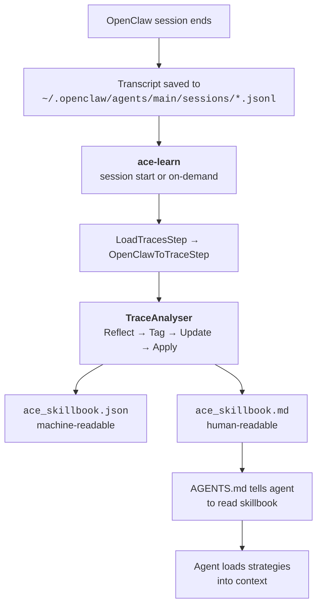

# OpenClaw Integration

Make your [OpenClaw](https://docs.openclaw.ai) agent **self-improving**. ACE reads session transcripts, extracts what worked and what didn't, and feeds learned strategies back into the agent's context via a skillbook — automatically, every session.

---

## What Is OpenClaw?

[OpenClaw](https://github.com/openclaw/openclaw) is an open-source, self-hosted AI assistant gateway. It connects AI models (Claude, GPT, etc.) to messaging platforms like Telegram, WhatsApp, Discord, and more. It runs locally and stores all data — sessions, memory, configuration — as files on your machine under `~/.openclaw/`.

ACE plugs into this by reading session transcripts and building a skillbook of learned strategies that the agent loads at session start.

---

## How It Works



1. OpenClaw writes session transcripts to `~/.openclaw/agents/<id>/sessions/*.jsonl`
2. `ace-learn` runs at the start of the next session (or on-demand)
3. **LoadTracesStep** reads JSONL files into raw event lists
4. **OpenClawToTraceStep** converts events into structured traces
5. **TraceAnalyser** runs the learning pipeline (Reflect → Tag → Update → Apply)
6. Updated skillbook is written to the workspace volume
7. The agent reads `ace_skillbook.md` into its context and applies relevant strategies

---

## Prerequisites

Before setting up ACE, you need a working OpenClaw installation.

### 1. Install OpenClaw

!!! note "Already have OpenClaw running?"
    Skip to [Setup Methods](#setup-methods) below.

=== "npm (quickest)"

    ```bash
    npm install -g openclaw@latest
    openclaw onboard --install-daemon
    ```

    The onboard wizard walks you through model provider setup, API keys, and optional channel connections (Telegram, WhatsApp, etc.).

=== "Docker"

    ```bash
    git clone https://github.com/openclaw/openclaw.git
    cd openclaw
    ./docker-setup.sh
    ```

    The setup script builds the image, runs onboarding, and starts the gateway via Docker Compose.

=== "From source"

    ```bash
    git clone https://github.com/openclaw/openclaw.git
    cd openclaw
    pnpm install && pnpm ui:build && pnpm build
    pnpm openclaw onboard --install-daemon
    ```

For full details, see the [OpenClaw documentation](https://docs.openclaw.ai).

### 2. Verify OpenClaw is working

Make sure the gateway is running and you have at least one completed session:

```bash
# Check the gateway is up
curl -fsS http://127.0.0.1:18789/healthz

# Check sessions exist
ls ~/.openclaw/agents/main/sessions/*.jsonl
```

### 3. Get an LLM API key for ACE

ACE needs its own LLM API key to run the reflection model. This is separate from the key OpenClaw uses. Any [LiteLLM-supported provider](https://docs.litellm.ai/docs/providers) works:

| Provider | Key variable | Example model |
|----------|-------------|---------------|
| Anthropic | `ANTHROPIC_API_KEY` | `anthropic/claude-sonnet-4-6` |
| OpenRouter | `OPENROUTER_API_KEY` | `openrouter/anthropic/claude-sonnet-4-6` |
| AWS Bedrock | `AWS_BEARER_TOKEN_BEDROCK` | `bedrock/us.anthropic.claude-sonnet-4-20250514-v1:0` |
| LiteLLM proxy | `LITELLM_API_KEY` | `anthropic/claude-sonnet-4-5` |

---

## Setup

Two steps: **install the skill** (copies files + patches AGENTS.md), then **choose how to run** the learning script.

### Step 1 — Install the skill

Clone the ACE repo and run the setup script:

```bash
git clone https://github.com/Kayba-ai/agentic-context-engine.git
cd agentic-context-engine
python examples/openclaw/setup.py
```

This does two things automatically:

1. **Copies** the `kayba-ace/` skill folder to `~/.openclaw/workspace/skills/kayba-ace/`
2. **Patches** `~/.openclaw/workspace/AGENTS.md` with auto-learning instructions

!!! tip "Options"
    ```bash
    python examples/openclaw/setup.py --no-agents        # skip AGENTS.md patching
    python examples/openclaw/setup.py --openclaw-home /path/to/.openclaw  # custom path
    ```

    The script is idempotent — it won't overwrite generated files (`ace_skillbook.json`, `ace_skillbook.md`, `ace_processed.txt`) and skips the AGENTS.md patch if already present.

### Step 2 — Choose how to run learning

| | Docker (recommended) | Host |
|---|---|---|
| **How it works** | Bakes ACE into the OpenClaw Docker image | Runs ACE on your host machine |
| **Learning trigger** | Agent runs `ace-learn` at session start | Cron job or manual |
| **Pros** | Zero runtime setup, fully automatic | No Docker customization needed |
| **Cons** | Requires rebuilding the image | Agent can't trigger learning itself |

---

## Docker Setup (Recommended)

Extends your OpenClaw Docker image with Python 3.12 and the ACE framework pre-installed. The agent runs `ace-learn` at session start automatically.

#### 2a — Get the Dockerfile

```bash
# From the ACE repo (already cloned in Step 1)
cp examples/openclaw/Dockerfile.ace /path/to/your/openclaw/
```

Or download it directly:

```bash
curl -o Dockerfile.ace \
  https://raw.githubusercontent.com/Kayba-ai/agentic-context-engine/main/examples/openclaw/Dockerfile.ace
```

#### 2b — Build the image

From your OpenClaw directory:

```bash
# Build the base OpenClaw image first (if not already built)
docker build -t openclaw:base .

# Extend with ACE
docker build -t openclaw:local --build-arg OPENCLAW_IMAGE=openclaw:base -f Dockerfile.ace .
```

!!! info "What this installs"
    The extended image adds ~200MB and includes:

    - **uv** — Python package manager
    - **Python 3.12** — via uv standalone builds (the base image ships 3.11)
    - **ACE framework** — cloned from GitHub at `/opt/ace` with all dependencies
    - **`ace-learn`** — wrapper script at `/usr/local/bin/ace-learn`

Then point your OpenClaw setup at the new image. In your `.env` file:

```bash
OPENCLAW_IMAGE=openclaw:local
```

#### 2c — Pass your API key

Add the ACE reflection key to your `docker-compose.yml` environment section (or `.env` file):

```yaml
services:
  openclaw-gateway:
    environment:
      # ... existing keys ...
      # Add ONE of these depending on your provider:
      AWS_BEARER_TOKEN_BEDROCK: ${AWS_BEARER_TOKEN_BEDROCK}
      ANTHROPIC_API_KEY: ${ANTHROPIC_API_KEY}
      OPENROUTER_API_KEY: ${OPENROUTER_API_KEY}
      LITELLM_API_KEY: ${LITELLM_API_KEY}
      # Optional: override the default reflection model
      ACE_MODEL: ${ACE_MODEL:-bedrock/us.anthropic.claude-sonnet-4-20250514-v1:0}
```

The default model is `bedrock/us.anthropic.claude-sonnet-4-20250514-v1:0`. Set `ACE_MODEL` in your `.env` to override.

#### 2d — Restart and verify

```bash
docker compose down && docker compose up -d openclaw-gateway
```

Send a message to your agent (e.g., via Telegram). It should:

1. Run `ace-learn` and report what it found
2. Read the skillbook into its context
3. Respond to your message, citing strategy IDs when relevant

You can also test directly:

```bash
# Dry run — parses sessions without making LLM calls
docker run --rm -v ~/.openclaw:/home/node/.openclaw openclaw:local ace-learn --dry-run

# Full run
docker run --rm \
  -v ~/.openclaw:/home/node/.openclaw \
  -e AWS_BEARER_TOKEN_BEDROCK="$AWS_BEARER_TOKEN_BEDROCK" \
  openclaw:local ace-learn
```

---

## Host Setup

Run ACE on the host machine (outside Docker). This reads session files directly from disk. Useful if you don't want to customize the Docker image.

#### 2a — Install ACE dependencies

From the ACE repo (already cloned in Step 1):

```bash
cd agentic-context-engine
uv sync
```

!!! note "Python 3.12+ required"
    Check with `python3 --version`. Install [uv](https://docs.astral.sh/uv/) if you don't have it.

#### 2b — Configure your API key

=== "Anthropic"

    ```bash
    export ANTHROPIC_API_KEY="sk-ant-..."
    ```

=== "OpenRouter"

    ```bash
    export OPENROUTER_API_KEY="sk-or-..."
    export ACE_MODEL="openrouter/anthropic/claude-sonnet-4-6"
    ```

=== "AWS Bedrock"

    ```bash
    export ACE_MODEL="bedrock/us.anthropic.claude-sonnet-4-20250514-v1:0"
    ```

    Uses AWS SDK auth — no explicit key needed if credentials are configured.

You can also put these in `~/.openclaw/.env` or `~/.env` — the script loads both via `python-dotenv`.

#### 2c — Verify and run

```bash
cd /path/to/agentic-context-engine

# Dry run (no LLM calls, just parse sessions)
uv run python ~/.openclaw/workspace/skills/kayba-ace/learn_from_traces.py --dry-run

# Learn from all new sessions
uv run python ~/.openclaw/workspace/skills/kayba-ace/learn_from_traces.py

# Process specific files
uv run python ~/.openclaw/workspace/skills/kayba-ace/learn_from_traces.py \
  ~/.openclaw/agents/main/sessions/f967d602.jsonl

# Reprocess everything
uv run python ~/.openclaw/workspace/skills/kayba-ace/learn_from_traces.py --reprocess
```

#### 2d — Automate with cron

```bash
crontab -e
```

Add:

```
*/30 * * * * cd /path/to/agentic-context-engine && uv run python ~/.openclaw/workspace/skills/kayba-ace/learn_from_traces.py >> /tmp/ace-openclaw.log 2>&1
```

!!! note "AGENTS.md for host setup"
    The setup script already patched AGENTS.md in Step 1. For the host setup, the agent can't run `ace-learn` directly (it's not in the container), so it will report that `ace-learn` is not found and continue normally. Learning happens externally via cron; the agent still reads the skillbook at session start.

---

## Output Files

The learning script writes these files to the skill directory:

| File | Format | Description |
|---|---|---|
| `ace_skillbook.json` | JSON | Machine-readable skillbook (persists across runs) |
| `ace_skillbook.md` | Markdown | Human-readable skillbook grouped by section |
| `ace_processed.txt` | Text | Tracks which sessions have been processed |

The agent loads strategies by **reading `ace_skillbook.md` at session start**. This must be an explicit instruction in AGENTS.md — OpenClaw does not auto-inline linked files. The agent uses its file-reading tools to load the content into its context window.

Once loaded, the agent can cite strategy IDs (e.g., `conversation_style-00003`) when applying them.

---

## Example Skillbook Output

After processing a few sessions, `ace_skillbook.md` might contain:

```markdown
## conversation_style

### `conversation_style-00003`

Maintain brief, natural responses without performative language

**Justification:** Establishes consistent conversational tone across interaction types
**Evidence:** Maintained direct, helpful tone across greeting, creative request,
modification, and casual follow-up

*Tags: helpful=5, harmful=0, neutral=0*

## debugging

### `debugging-00005`

Test litellm calls directly before debugging ace_next pipeline

**Justification:** Systematic debugging approach that isolated authentication issues
**Evidence:** Direct litellm.completion() calls worked while ace_next failed

*Tags: helpful=1, harmful=0, neutral=0*
```

---

## Reference

### Environment variables

| Variable | Default | Description |
|---|---|---|
| `ACE_MODEL` | `bedrock/us.anthropic.claude-sonnet-4-20250514-v1:0` | LLM for reflection and skill extraction |
| `OPENCLAW_AGENT_ID` | `main` | Agent ID for session discovery |
| `OPENCLAW_HOME` | `$HOME/.openclaw` | OpenClaw home directory (used by `ace-learn` only) |
| `LITELLM_API_KEY` | — | API key (for non-Bedrock providers) |
| `SPH_LITELLM_KEY` | — | Alternative API key variable |
| `AWS_BEARER_TOKEN_BEDROCK` | — | AWS Bedrock bearer token |
| `ANTHROPIC_API_KEY` | — | Anthropic API key |
| `OPENROUTER_API_KEY` | — | OpenRouter API key |

### CLI arguments

```
ace-learn [OPTIONS] [FILES...]

Options:
  --dry-run          Parse sessions but skip learning (no LLM calls)
  --reprocess        Ignore processed log, reprocess all sessions
  --agent AGENT_ID   OpenClaw agent ID (default: main)
  --output DIR       Output directory for skillbook files
  --opik             Enable Opik observability logging

Positional:
  FILES              Specific JSONL files to process (skips discovery)
```

### Pipeline steps

**LoadTracesStep** — Reads a JSONL file and parses each line into a list of event dicts.

**OpenClawToTraceStep** — Converts raw OpenClaw events into a structured trace:

```python
{
    "question": "User: ...\n\nUser: ...",
    "reasoning": "[thinking] ...\n[tool:read] ...\n[response] ...",
    "answer": "Last assistant response",
    "skill_ids": [],
    "feedback": "OpenClaw session: 3 user messages, 1 assistant responses, model: ..., 14605 tokens",
    "ground_truth": None
}
```

**TraceAnalyser** — Runs the ACE learning tail:

1. **Reflect** — LLM analyzes the trace for patterns, errors, and effective strategies
2. **Tag** — Scores cited skills as helpful/harmful/neutral
3. **Update** — LLM decides skillbook mutations (ADD, UPDATE, REMOVE, CONSOLIDATE)
4. **Apply** — Commits changes to the in-memory skillbook

---

## Troubleshooting

??? question "Sessions directory not found"
    The agent hasn't completed a session yet, or `OPENCLAW_AGENT_ID` is wrong. Check:

    ```bash
    ls ~/.openclaw/agents/
    ```

??? question "Nothing new to learn from"
    All sessions have been processed. Use `--reprocess` to rerun, or wait for new sessions.

??? question "`ace-learn` not found in Docker"
    Make sure you built with `Dockerfile.ace` and are using the correct image tag:

    ```bash
    docker run --rm openclaw:local which ace-learn
    ```

??? question "Import errors for `ace_next` (host setup)"
    The Docker image includes a cloned copy of the ACE repo at `/opt/ace` with all dependencies pre-installed — this is handled by `Dockerfile.ace`. For the host setup, make sure you run from the ACE repo root with `uv run` so that `ace_next` is importable:

    ```bash
    cd /path/to/agentic-context-engine
    uv run python ~/.openclaw/workspace/skills/kayba-ace/learn_from_traces.py
    ```

??? question "API key errors in Docker"
    Make sure your LLM API key is passed through `docker-compose.yml`. Check with:

    ```bash
    docker compose exec openclaw-gateway env | grep -E 'API_KEY|BEARER_TOKEN|ACE_MODEL'
    ```

---

## What to Read Next

- [Integration Pattern](../guides/integration.md) — how the INJECT/EXECUTE/LEARN pattern works
- [The Skillbook](../concepts/skillbook.md) — how learned strategies are stored
- [ACE Design](../ACE_DESIGN.md) — architecture and step reference
